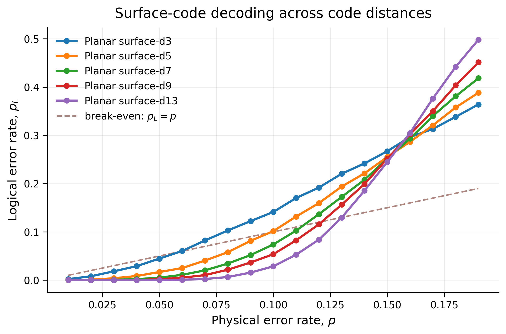
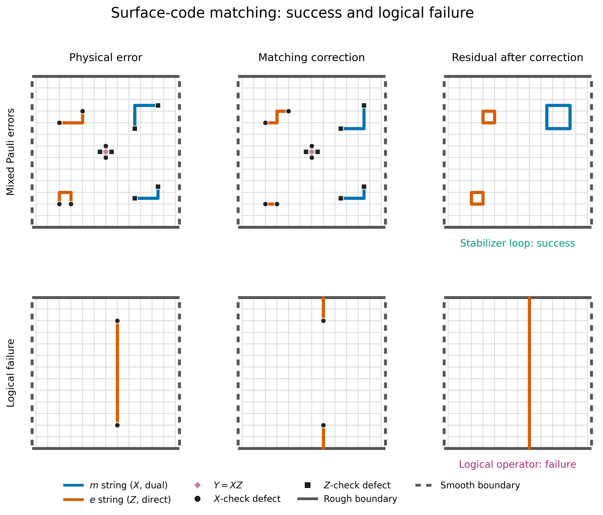

# Quantum Error Correction: Decoding and Magic-State Distillation

Python simulations exploring quantum error correction and magic-state distillation, two building blocks of fault-tolerant quantum computing. Includes Monte Carlo logical-error-rate curves for surface codes and the Bravyi–Kitaev protocol for magic state distillation using the [[15,1,3]] quantum Reed–Muller code. Work in progress.

### Installation

```bash
python -m pip install numpy matplotlib rich pymatching qiskit qiskit-aer
```

## Quantum error decoder

- Stabilizer codes in binary symplectic form, such as surface codes.
- Minimum-weight lookup decoding and surface-code matching.
- Monte Carlo logical-error-rate curves across code distances.

<p align="center">
  
</p>
<p align="center"><em>Logical error rates for planar surface codes across code distances.</em></p>

<p align="center">
  
</p>
<p align="center"><em>Minimum-weight matching: a successful correction and a logical failure.</em></p>

Run the experiments from the repository root:

```bash
python -m quantum_error_decoder.experiments.fixed_weight_errors
python -m quantum_error_decoder.experiments.logical_error_rate_curves
python -m quantum_error_decoder.experiments.planar_surface_distances
python -m quantum_error_decoder.experiments.planar_surface_matching_demo
```

## Magic-state distillation

A Qiskit simulation of the 15-to-1 Bravyi–Kitaev protocol.

- The [[15,1,3]] quantum Reed–Muller code and its encoding circuit.
- Magic-state injection and transversal logical T.
- Stabilizer-syndrome measurement and postselection of accepted blocks.
- Output-state fidelity estimation under noisy input magic states.

```bash
python -m magic_state_distillation.experiments.output_fidelity
```
